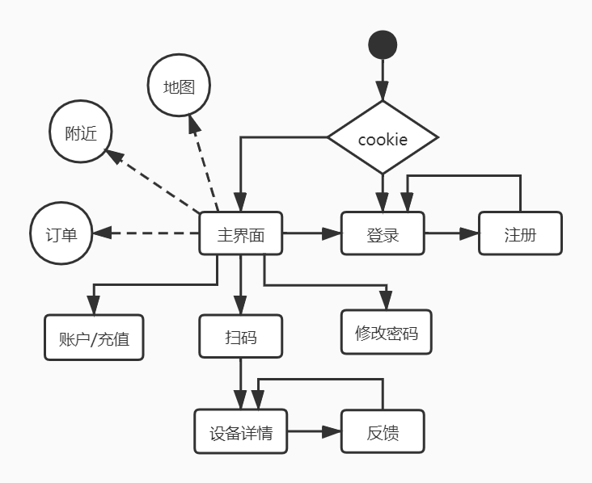
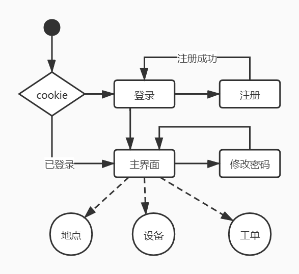
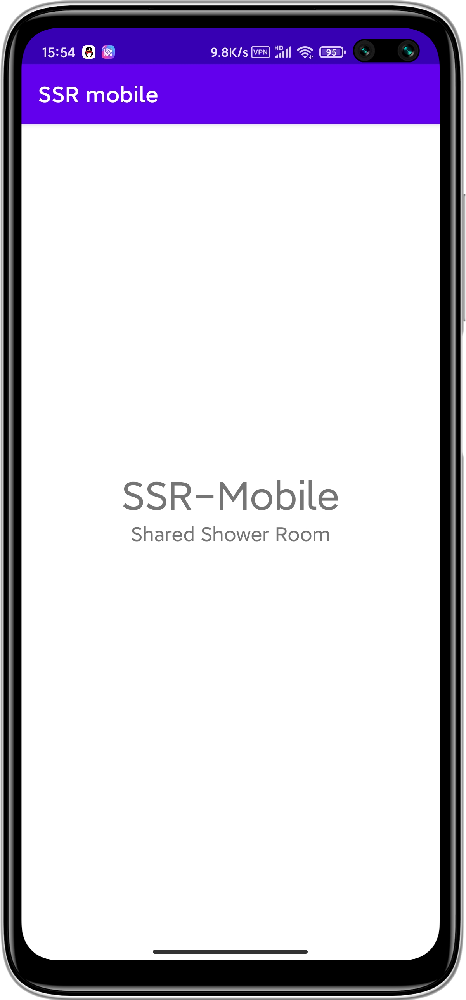
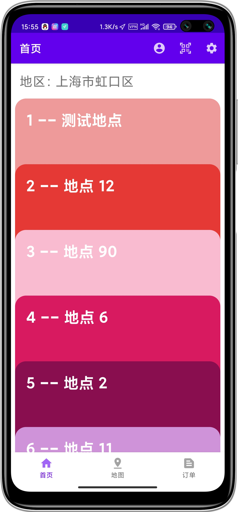
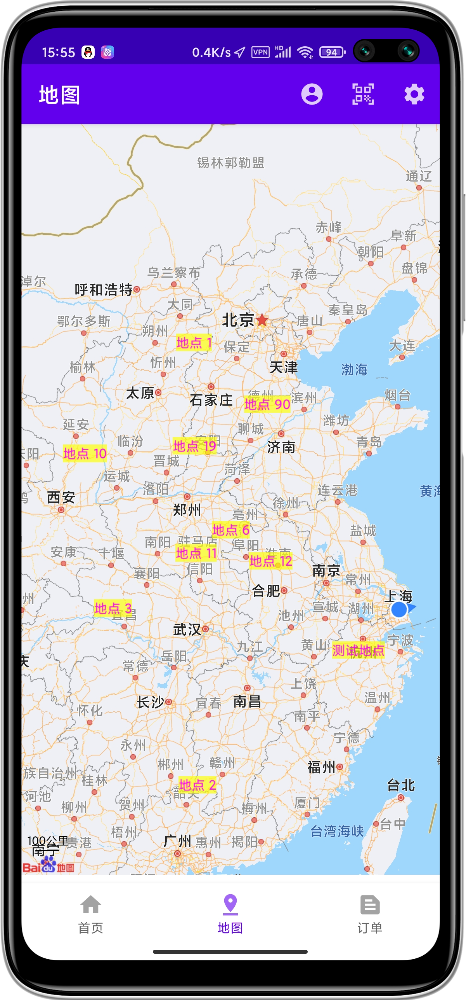
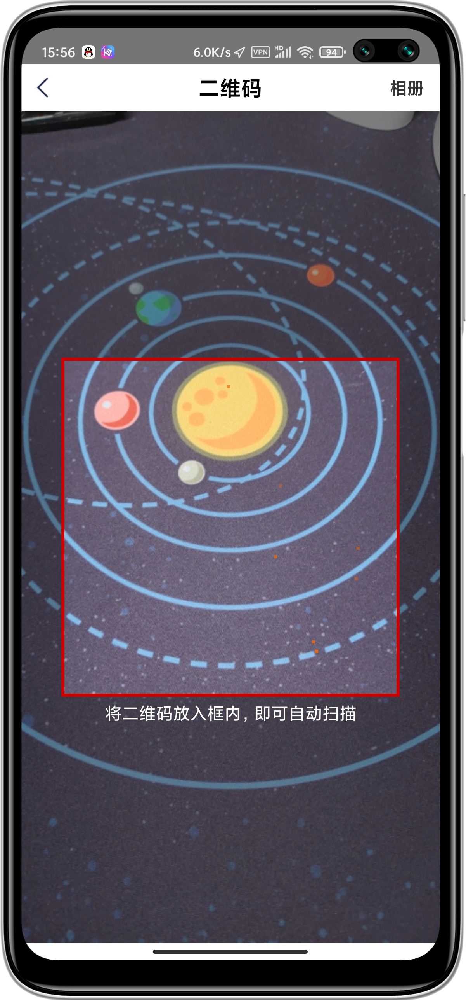
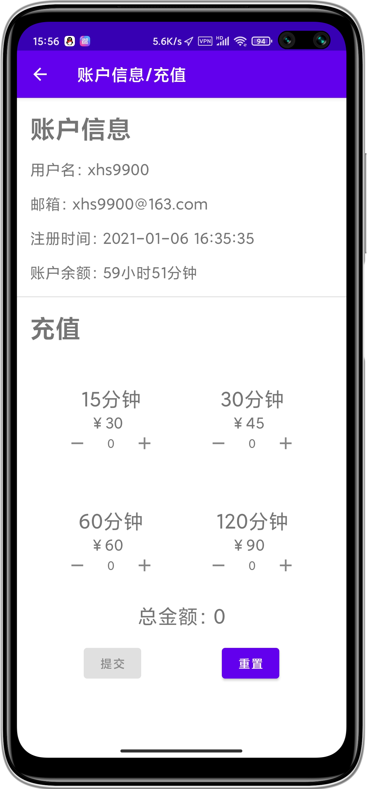
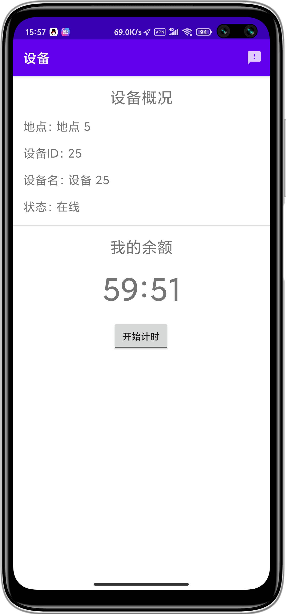
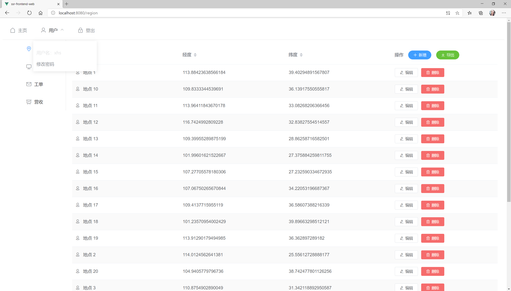
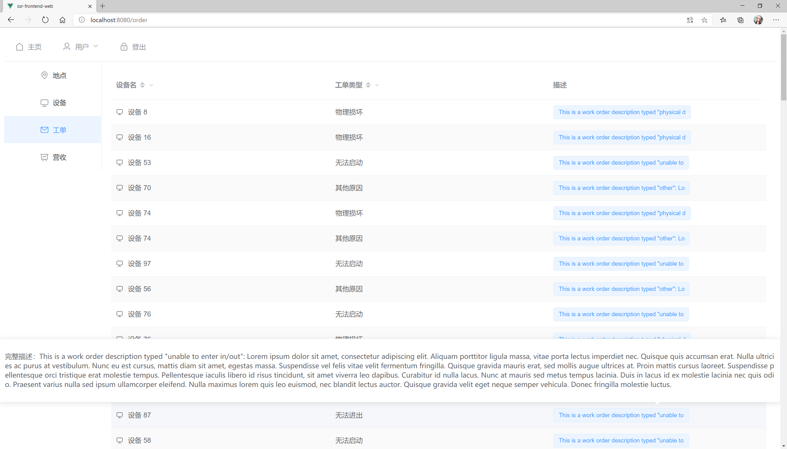

# 《移动互联网》项目报告-SSR

## 概述

本项目实现了一个共享淋浴房平台系统的原型（SSR, Shared Shower Room）。其中前端包括基于Android开发的移动端和基于Vue.js开发的PC端；后端采用了Django进行开发，引入了单元测试保证其稳定性。

## 功能介绍

### 商家

作为淋浴服务的提供者（下文称为商家），商家可以在该平台的PC端创建账号，进行账号相关的操作（注册登录，修改密码，重置密码）。

作为拥有设备的商家，商家可以创建并管理自己设置的地点信息和设备信息，进行增删查改。在查看设备信息时，PC端支持商家根据设备地点，设备状态等字段进行筛选，提高了系统的可用度。

为了和顾客进行交互，商家还可以查看顾客提交的反馈信息，根据反馈信息的类型对实际设备进行相关操作。

作为一个平台系统，PC端支持导出设备数据和用户数据，方便商家进行进一步统计。

### 顾客

作为淋浴服务的使用者（下文称为顾客），顾客可以在该平台的移动端创建账号，进行账号相关的操作（注册登录，修改密码，查看账号详情）。

作为使用设备的顾客，顾客可以利用Android设备提供的GPS定位服务查找附近的设备。附近设备的信息在应用列表中显示，顾客也可以在地图上查看其具体位置。

顾客在找到设备后，可以利用移动端提供的二维码扫描功能，扫描设备上的二维码，进入设备操作界面。当顾客结束使用设备后，系统会按照使用时长在其账户余额中扣除相应时长。

顾客如果发现设备发生故障，可以在移动端向服务器发送反馈信息。当商家登录PC端平台后，会从服务器拉取相应的反馈信息，并作出进一步反应。

顾客在结束使用设备后，可以在订单区域查看自己之前的使用记录，包括设备ID，开始使用时间和结束使用时间。

## 界面设计

### 移动端

#### 界面逻辑



#### 界面UI

移动端使用的大部分UI组件均为Android提供的原生组件。在附近设备和订单视图中，使用了GitHub开源的[CardStackView](https://github.com/loopeer/CardStackView)。

### PC端

#### 界面逻辑



#### 界面UI

PC端主要使用了[Element-UI](https://element.eleme.cn/#/zh-CN)提供的UI组件。

## 项目效果

### 移动端

<center class="half">
    
    
    
</center>

<center class="half">
    
    
    
</center>


### PC端







## 项目运行方法

### 后端

后端使用了Django框架和一些辅助模块。在运行之前，请运行下列命令，确保电脑上安装有以下模块：

```shell
$pip3 install django
$pip3 install django-cors-headers
$pip3 install djangorestframework
$pip3 install validators
```

要运行后端，请在项目目录`SSR_backend`下，运行以下命令：

```sh
python3 manage.py runserver address:port
```

其中`address`指后端运行所使用的IP地址，`port`指后端运行使用的端口号，请按需配置。

### 移动端

建议使用Android Studio运行移动端。

在运行前，请修改项目目录`SSRmobile`中的`build.gradle`文件，相对路径为`/SSRmobile/app/build.gradle`。

该文件的部分内容如下所示：

```
android {
    compileSdkVersion 30
    buildToolsVersion "30.0.2"

    defaultConfig {
        applicationId "com.example.ssrmobile"
        minSdkVersion 26
        targetSdkVersion 30
        versionCode 1
        versionName "1.0"
        buildConfigField "String", "BASE_URL", "\"http://45.77.18.246:8000/users/\""
//        buildConfigField "String", "BASE_URL", "\"http://192.168.1.105:8000/users/\""

        testInstrumentationRunner "androidx.test.runner.AndroidJUnitRunner"
    }

    buildTypes {
        release {
            minifyEnabled false
            proguardFiles getDefaultProguardFile('proguard-android-optimize.txt'), 'proguard-rules.pro'
        }
    }
    compileOptions {
        sourceCompatibility JavaVersion.VERSION_1_8
        targetCompatibility JavaVersion.VERSION_1_8
    }
    sourceSets{
        main{
            jniLibs.srcDir 'libs'
            jni.srcDirs = []    //disable automatic ndk-build
        }
    }
}
```

请将`defaultConfig`中`buildConfigField`字段中的`BASE_URL`的IP地址和端口号改为后端自行配置的IP地址和端口号。注意不要删去`/users/`部分。

修改结束后，请重新编译项目（`顶部状态栏->Build->Rebuild Project`）。

请在运行前确保安装了必需的Android SDK。

### PC端

请在运行前确保安装了`node.js`（包含`npm`）以及`vue-cli`。

在运行前，请修改项目目录`ssr-frontend-web`中的配置文件，相对路径为`/ssr-frontend-web/.env`。

请将文件中`VUE_APP_URL`中IP地址和端口号改为后端自行配置的IP地址和端口号。

运行PC端，请在项目目录下运行以下命令：

```
npm run serve
```

## 项目工作介绍

### 工作量

#### 后端

2000行代码，主要为单元测试部分（936行）和视图逻辑部分（762行）。

##### 单元测试

该项目完成了后端视图逻辑代码的单元测试，覆盖率91%。具体细节可前往项目目录`SSR_backend`的`htmlcov`目录下`index.html`查看。

#### 移动端

2000行代码，主要为复杂Activity，例如`BasicActivity`（376行）、`RegisterActivity`（163行）等等。

#### PC端

1600行代码，主要为Vue组件的html模板部分以及Fetch API的回调函数部分。

### 项目技术

#### Fragment和Activity交互

Android移动端的主界面使用了Google原生的Bottom Navigation Activity。这个Activity由3个互相切换的Fragment和一个底部导航栏组成。为了实现在Fragment和Activity之间传递数据和信号，我采用了不同的方法。

##### Fragment向Activity获取数据

在移动端，Fragment需要不定期向Activity获取相关数据，例如附近地点，交易记录等等。我采取的解决方式是将Activity中的相关数据权限设为全局（静态公开），Fragment需要的时候直接访问即可。

##### Activity向Fragment发送信号

在移动端，Activity可能需要向当前活跃的Fragment发送信号，例如命令Fragment刷新UI。我使用了接口+回调函数的方式解决了这个问题。

具体实现方式是在Activity中定义一个公开接口`FragmentListener`，其中包含一个回调函数`callback`；随后让三个Fragment均实现该接口，决定当该回调函数被触发后需要完成的操作。当Activity需要向当前活跃的Fragment发送信号时，通过`ChildFragmentManager`提供的`getPrimaryNavigationFragment`方法获取当前活跃的Fragment，在其实现的接口上执行回调函数即可。

#### 父组件和router-view交互

PC端通过route动态决定父组件下绑定的子组件。如何在父组件和router-view之间交互成了一个问题，因为父组件和子组件之间不存在显式的绑定关系。我的解决方法是在html模板的`router-view`中添加`v-bind`参数，绑定需要传递的数据/信号，在子组件的Vue实例中定义`props`属性，再添加一个观察属性`watch`，就实现了父组件向`router-view`传递数据/信号的功能。

#### 外部调用

##### 移动端

移动端使用了[百度地图SDK](http://lbsyun.baidu.com/index.php?title=androidsdk)提供的定位服务和地图界面。

移动端使用了GitHub开源的[ZXing](https://github.com/zxing/zxing)的一部分，用于实现二维码扫描功能。